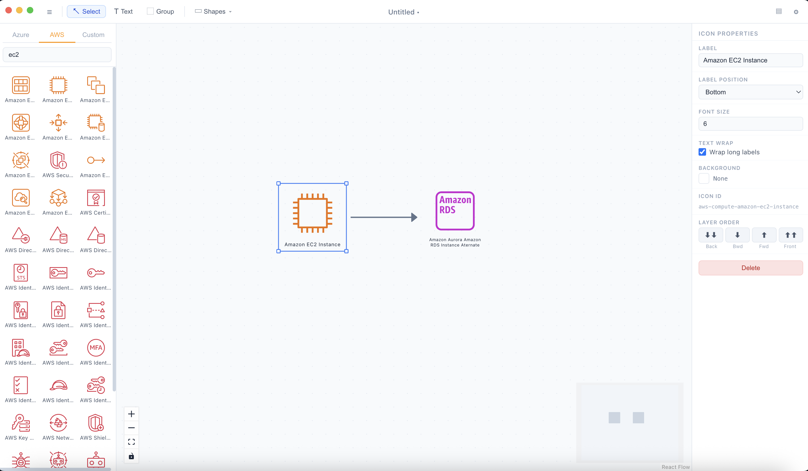

# ArchDiagram

A local Mac desktop app for creating cloud architecture diagrams — built with Electron, React, and React Flow.



> **Video walkthrough:** [Watch on YouTube](https://youtube.com/your-link-here)

---

## Features

- **Drag-and-drop icons** from built-in AWS / Azure icon libraries
- **Custom icon packs** — point the app at any folder of SVGs, no manifest required
- **Shapes** — rectangle, ellipse, diamond, cylinder, parallelogram, hexagon
- **Arrows & lines** — configurable direction (forward, backward, both, none), solid or dashed, animated
- **Bounding boxes** and **text labels**
- **Layer controls** — Bring to Front, Bring Forward, Send Backward, Send to Back
- **Node properties** — font size, text wrap, background color, label position
- **HD export** — PNG (3840×2560) and PDF (A3)
- **Auto-save awareness** — dirty state indicator in the title bar
- **Persistent settings** — custom icon directory remembered across restarts

---

## Getting Started

### Prerequisites

- Node.js 18+
- macOS (arm64 or x64)

### Install & run

```bash
npm install
npm run dev
```

### Build for distribution

```bash
npm run package
```

The distributable `.dmg` will be written to `release/`.

---

## Custom Icons

1. Open **Settings** (⚙ in the toolbar)
2. Click **Browse** and select any folder containing SVG files
3. Click **Reload Icons**

Icons are discovered automatically from filenames — no `manifest.json` needed. Files following the AWS naming convention (`Res_<Service>_<Resource>_48.svg`) are grouped by service automatically.

---

## Project Structure

```
electron/        Electron main process (IPC handlers, settings, menu)
src/
  components/    React UI (toolbar, canvas, sidebar, properties panel)
  store/         Zustand state (diagramStore, uiStore)
  registry/      Icon registry and SVG loading
  hooks/         File I/O, export, keyboard shortcuts
resources/       App icon
```

---

## Tech Stack

| Layer | Library |
|---|---|
| Desktop shell | Electron 33 |
| Build | electron-vite + Vite |
| UI | React 18 |
| Diagramming | React Flow (@xyflow/react) |
| State | Zustand + Immer |
| Icon search | Fuse.js |
| Export | html-to-image + jsPDF |
